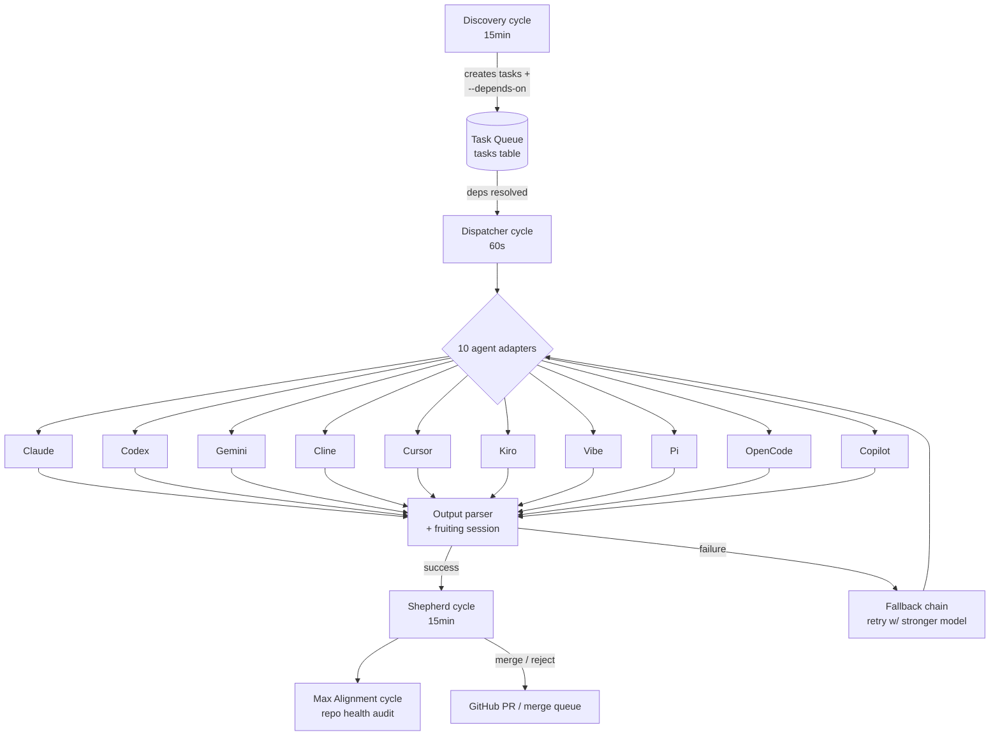
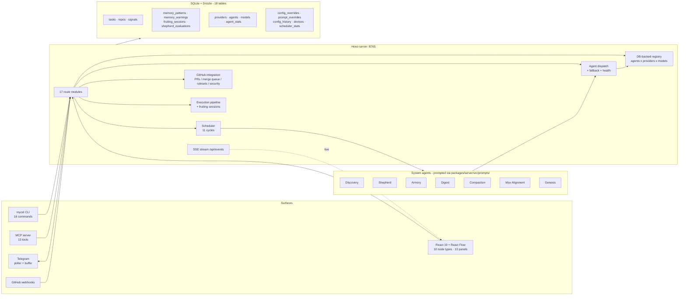

# Mycelium v2

> Archived Jan-Feb 2026 architectural exploration. See [Status](#status) at the bottom for context.

A multi-agent coding orchestration system. Three things in here are uncommon in the 2026 agent-framework landscape:

- **Real CLI-adapter substrate** — 10 actual coding-CLI integrations (Claude Code, Codex, Gemini, Cline, Cursor, Kiro, Vibe, Pi, OpenCode, Copilot) shelling to real binaries, not just LLM API wrappers. Fallback chains across 12 providers.
- **MCP server wrapping its own HTTP API** — `packages/mcp` exposes 13 tools so any MCP-aware client (Claude Code, Cursor, etc.) can drive Mycelium directly. Recursive composition.
- **Architecture-graph-as-UI** — the React Flow control surface *is* the system diagram. 10 node types each map to a real subsystem; clicking a node routes the matching panel into the right sidebar.

Underneath those, the standard 2026 shape: Discovery → Task Queue → Dispatcher → fan-out → Shepherd, with seven named system-agents (Discovery, Shepherd, Armory, Digest, Compaction, Max Alignment, Genesis) running on an 11-cycle scheduler.

### Task lifecycle



## Features

- **Multi-Agent Dispatch** - Route tasks to 10 agents (Claude, Codex, Gemini, Cline, Cursor, Kiro, Vibe, Pi, OpenCode, Copilot) across 12 providers
- **Automatic Discovery** - Agents scan repos for TODOs, lint errors, outdated deps, test failures
- **Dependency Chains** - Wire tasks with `--depends-on` for sequential execution
- **Parallel Execution** - Independent tasks run concurrently (configurable limit)
- **Dynamic Registry** - DB-backed agent/provider/model registry with CLI auto-detection and provider API model fetching
- **Health Tracking** - Monitors agent quotas, auto-backs off when limits hit
- **Cost Tracking** - Per-task cost tracking for pay-per-use agents
- **Fallback Chains** - Automatic retry with different models on failure
- **Real-time Streaming** - SSE streaming of agent output to frontend
- **Telegram Integration** - Notifications, alignment signals, remote control
- **MCP Server** - 13-tool MCP server (`packages/mcp`) wrapping the HTTP API so any MCP-aware client (Claude Code, Cursor, etc.) can drive Mycelium directly
- **GitHub Integration** - PRs, webhooks, security scanning, rulesets, merge queue
- **Max Alignment** - Repo-level health audits: runtime verification, doc alignment, cruft cleanup
- **Startup Safety** - Orphaned tasks cleaned up on restart to prevent token burn

## Quick Start

### Prerequisites

- [Bun](https://bun.sh) v1.0+
- SQLite3
- At least one agent CLI installed:
  - `claude` - [Claude Code](https://claude.ai/code)
  - `codex` - [OpenAI Codex](https://github.com/openai/codex)
  - `gemini` - [Gemini CLI](https://github.com/google/gemini-cli)
  - `cline` - [Cline](https://github.com/cline/cline)
  - `agent` - [Cursor Agent](https://cursor.com)
  - `kiro-cli` - [Kiro CLI](https://kiro.dev) (AWS)
  - `vibe` - [Mistral Vibe](https://mistral.ai)
  - `pi` - [Pi Coding Agent](https://github.com/badlogic/pi-mono)
  - `opencode` - [OpenCode](https://github.com/sst/opencode)
  - `copilot` - [GitHub Copilot CLI](https://github.com/features/copilot)

### Installation

```bash
# Clone and install
git clone https://github.com/matthew-kissinger/mycelium-v2.git
cd mycelium-v2
bun install

# Copy environment config
cp .env.example .env.local

# Build all packages
bun run build

# Start development server
bun run dev
```

### Configuration

Edit `.env.local`:

```bash
# Server
PORT=8765
HOST=0.0.0.0

# Auto-start scheduler on boot
SCHEDULER_AUTO_START=true

# Telegram (optional)
TELEGRAM_BOT_TOKEN=your_token
TELEGRAM_CHAT_ID=your_chat_id

# GitHub (optional - for PR creation, webhooks, security scanning)
GITHUB_WEBHOOK_SECRET=your_webhook_secret
# Also run: gh auth login
```

## Architecture

### System architecture



### Monorepo

```
packages/
  shared/     # Zod schemas, types, constants
  server/     # Hono API + scheduler + agent dispatch + system-agents
  client/     # React 19 + React Flow control surface
  cli/        # mycel CLI tool
  mcp/        # MCP server (13 tools) for agent integration
```

### Scheduler Cycles

| Cycle | Interval | Purpose |
|-------|----------|---------|
| Dispatcher | 60s | Run tasks with resolved deps |
| Discovery | 15min | Scan repos, create tasks with deps |
| Shepherd | 15min | Evaluate completed tasks, merge/reject |
| Armory | 1h | Skill/MCP inventory (batch threshold) |
| Digest | 6h | Smart status summaries (Haiku agent) |
| Compaction | 4h | Semantic memory cleanup (Haiku agent) |
| Max Alignment | 15min | Repo-level health audit after shepherd evaluations |
| Health Check | 60s | Monitor device connectivity, provider status |
| Blocked Check | 15min | Detect stuck/orphaned tasks |
| GitHub Sync | 30min | Cache repo slugs, default branches, enable security |
| Registry Refresh | 6h | Re-detect agent CLIs, refresh provider models |

### Task Flow

```
1. Discovery creates tasks (with --depends-on for dependencies)
2. Dispatcher runs tasks when deps resolve
3. On success: Telegram notification
4. On failure: Retry with fallback model, or cancel dependents
5. Shepherd evaluates results per repo
6. Max Alignment audits repo health after shepherd evaluations accumulate
```

## CLI Usage

### Task Management

```bash
# Create a task
mycel task create "Fix auth bug" \
  --repo /path/to/project \
  --agent claude \
  --model sonnet \
  --prompt "Fix the authentication bug in login.ts..."

# Create with dependencies
mycel task create "Add tests" \
  --repo /path/to/project \
  --agent codex \
  --depends-on abc123 def456

# For Cline, specify billing provider
mycel task create "Implement feature" \
  --repo /path/to/project \
  --agent cline \
  --model kimi-k2.5 \
  --provider openrouter

# List tasks
mycel tasks
mycel tasks --status pending
mycel tasks --repo /path/to/project

# Task operations
mycel task info <id>
mycel task run <id>
mycel task cancel <id>
mycel task delete <id>
```

### Repository Management

```bash
# Add repos to network
mycel repos add /path/to/project
mycel repos add /path/to/project --description "My project"

# List and discover
mycel repos
mycel repos discover ~/code

# Trigger discovery
mycel discover /path/to/project --agent --auto
```

### Alignment (Human-in-the-Loop)

```bash
# Ask for human input (async via Telegram)
mycel align "Should I refactor this?" --options "Yes" "No" "Skip"

# Check responses
mycel signals
mycel check

# Send notifications
mycel notify "Task completed successfully"
```

### Registry

```bash
# View agent/provider/model matrix
mycel registry

# Agent management
mycel registry agents
mycel registry detect

# Provider and model info
mycel registry providers
mycel registry models [--agent claude] [--free]

# Refresh and health
mycel registry refresh
mycel registry health
mycel registry fallback claude sonnet
```

### System Control

```bash
# Scheduler
mycel runner start
mycel runner stop
mycel runner status

# Stats
mycel stats
mycel repos health
```

## Agent Configuration

### Supported Agents

| Agent | Command | Billing | Best For |
|-------|---------|---------|----------|
| Claude | `claude` | Subscription | Architecture, complex debugging |
| Codex | `codex` | Subscription | Code generation, mechanical refactors |
| Gemini | `gemini` | Subscription | Fast iteration, large context (1M) |
| Cursor | `agent` | Subscription | Multi-file composition |
| Kiro | `kiro-cli` | Subscription (AWS) | Spec-driven development |
| Copilot | `copilot` | Subscription | GitHub integration |
| OpenCode | `opencode` | Free | Free models (kimi, glm, gpt-5-nano) |
| Cline | `cline` | OpenRouter/Cline | 100+ models, multi-file work |
| Vibe | `vibe` | Per-use (Mistral) | Devstral models |
| Pi | `pi` | Multi-provider | 7 providers (groq, cerebras, etc.) |

**Note:** Groq and Cerebras are providers, not standalone agents. Access via `pi --provider groq`.

### Cline Provider Selection

Cline supports two billing providers:

```bash
# Use OpenRouter credits
mycel task create "..." --agent cline --provider openrouter

# Use Cline account credits
mycel task create "..." --agent cline --provider cline
```

### Fallback Chains

When a task fails, Mycelium can retry with a more capable model:

```
Claude:  haiku -> sonnet -> opus
Codex:   gpt-5.2-codex-fast -> gpt-5.2-codex -> gpt-5.3-codex
Gemini:  flash -> gemini-3-flash -> gemini-3-pro
Cline:   glm-4.7-flash -> glm-4.7 -> deepseek-v3.2 -> qwen3-coder -> kimi-k2.5
Cursor:  gemini-3-flash/gpt-5.2-codex/sonnet-4.5 -> composer-1 -> opus-4.6-thinking

Cross-agent: codex->cursor, pi->opencode, opencode->gemini, vibe->cline
```

Quota errors skip retry (account-wide limit, not model-specific).

## API Endpoints

### Tasks
```
GET    /api/tasks              List tasks
POST   /api/tasks              Create task
GET    /api/tasks/:id          Get task
PATCH  /api/tasks/:id          Update task
DELETE /api/tasks/:id          Delete task
POST   /api/tasks/:id/run      Execute task
POST   /api/tasks/:id/cancel   Cancel running task
POST   /api/tasks/:id/merge    Merge task branch (GitHub PR or local git)
GET    /api/tasks/:id/logs     Get task output
GET    /api/tasks/:id/context  Get enriched task context
GET    /api/tasks/:id/sessions Get fruiting sessions
GET    /api/tasks/graph        Get dependency graph
```

### Scheduler
```
GET    /api/scheduler/status   Scheduler status
POST   /api/scheduler/start    Start scheduler
POST   /api/scheduler/stop     Stop scheduler
GET    /api/health             Health check with agent status
```

### GitHub
```
POST   /api/github/webhook         Receive GitHub webhook events
POST   /api/github/setup-security  Enable security features on repos
POST   /api/github/rulesets/apply  Apply branch rulesets to public repos
GET    /api/github/rulesets/:owner/:repo  List rulesets for a repo
GET    /api/github/runner/status   Self-hosted runner status
```

### Registry
```
GET    /api/registry/agents              List agents with status
GET    /api/registry/agents/:id          Agent detail + models + health
PATCH  /api/registry/agents/:id          Update agent (enable/disable, timeout)
GET    /api/registry/providers           List providers with credits
GET    /api/registry/providers/:id       Provider detail + models
PATCH  /api/registry/providers/:id       Update provider config
POST   /api/registry/providers/:id/refresh  Fetch models for provider
GET    /api/registry/models              List models (filter: ?agent=X&provider=Y&free=true)
PATCH  /api/registry/models/:id          Update model
GET    /api/registry/matrix              Full agent-provider-model matrix
GET    /api/registry/health              Health summary
POST   /api/registry/detect              Trigger CLI detection
POST   /api/registry/refresh             Trigger full refresh
GET    /api/registry/credentials         List available credential keys
GET    /api/registry/fallback/:agent/:model  Show fallback chain
```

### Real-time
```
GET    /api/events             SSE stream for live updates
```

## Frontend

The React 19 + React Flow frontend is a **control surface**, not a passive viewer. The architecture graph at `packages/client/src/flow/architecture.ts` declares the system as a set of nodes; the frontend renders them, lets you act on them, and routes per-node detail into a composable side panel.

- **Dual-sidebar layout** — `LeftSidebar` (always-visible navigation + system overview) + `RightPanel` (context-aware detail surface). Responsive: collapses to hamburger + modal on mobile/tablet.
- **10 React Flow node types** — `AgentSlots, Alignment, Cycle, GitHub, MaxAlignment, Memory, Registry, Repos, Scheduler, TaskPool`. Each one a real system subsystem; clicking a node routes the matching panel into the right sidebar via `usePanelRouter`.
- **13 composable panels** — `Agent, Alignment, Cycle, GitHub, Inventory, Logs, MaxAlignment, Memory, Prompts, Registry, Repos, Scheduler, TaskPool`. Drop-in modules with their own state (Zustand + TanStack Query). New panels register in `panels/index.ts`; new node types register in `nodes/index.ts`. The composition pattern is the extension point — adding a subsystem means adding a node, a panel, and a route, not editing a monolith.
- **Live SSE stream** — `/api/events` pushes task / scheduler / agent / repo events into the UI in real time.
- **Config editors live in-panel** — Scheduler cycles, agent enable/disable, prompt overrides, registry tuning are all editable from their respective panels, no separate admin view.

Access at `http://localhost:5765` when running `bun run dev:client`.

## NixOS Integration

For NixOS users, a home-manager module is provided:

```nix
# In home.nix
services.mycelium = {
  enable = true;
  server.enable = true;
  scheduler.enable = true;  # Auto-starts scheduler
};
```

See `nix/README.md` for full documentation.

## Development

```bash
# Dev management script (recommended)
bun run dev:manage start       # Start backend + frontend
bun run dev:manage stop        # Stop all services
bun run dev:manage status      # Show status + health
bun run dev:manage logs        # Tail logs
bun run dev:manage check       # Task stats + scheduler
bun run dev:manage scheduler start  # Start scheduler via API

# Manual
bun run dev                    # Backend only (port 8765)
bun run dev:client             # Frontend only (port 5765)

# Build
bun run build

# Tests
bun test
```

## Stack

| Layer | Technology |
|-------|------------|
| Runtime | Bun |
| Backend | Hono |
| Database | SQLite (bun:sqlite) + Drizzle ORM |
| Frontend | React 19 + Vite |
| Node Editor | React Flow (@xyflow/react) |
| State | Zustand + TanStack Query |
| Styling | Tailwind v4 |
| Validation | Zod |
| Real-time | Server-Sent Events (SSE) |

## What worked, where it stopped

This worked, for a while — and a fair amount of mycelium-v2's own codebase was built by mycelium-v2 running unsupervised on itself. Agents picked up tasks against this repo, the seven system-agents discovered work, executed it, shepherded the output, and routed alignment signals to Telegram for the moments a human-in-the-loop check was needed. End to end, with real CLIs against real code, including its own.

The wall it hit was **unsupervised discovery at length**. Keeping the loop productive across many tasks without a human in it kept breaking down with the agents and tooling available in early 2026 — Discovery would converge on stale or low-value work, Shepherd evaluations were noisy enough to wave through bad output, Max Alignment drifted from the actual repo state. The system worked as a supervised orchestrator and as a short-horizon autonomous one; it did not yet hold up over the long horizon I wanted.

Capable agents and IDE-side agent modes have moved a lot since. A future iteration would take a different shape — probably incorporating ideas from adjacent tools I've been building — but **there is no v3 in active development**. The vision is real, the build is not yet.

## Status

This repository is a frozen Jan-Feb 2026 snapshot, archived as a reference artifact. The code, the docs, and the design notes are kept public for anyone mining ideas, tracing my work, or interested in what one snapshot of this design space looked like in early 2026. Issues and PRs will not be triaged.

Built in paired-dev mode from a hub workstation; commits are authored under `MK Agent` (the operating identity), not my personal handle.

This was a TypeScript rewrite of an earlier Python exploration; the prior generation remains private.

## License

MIT
